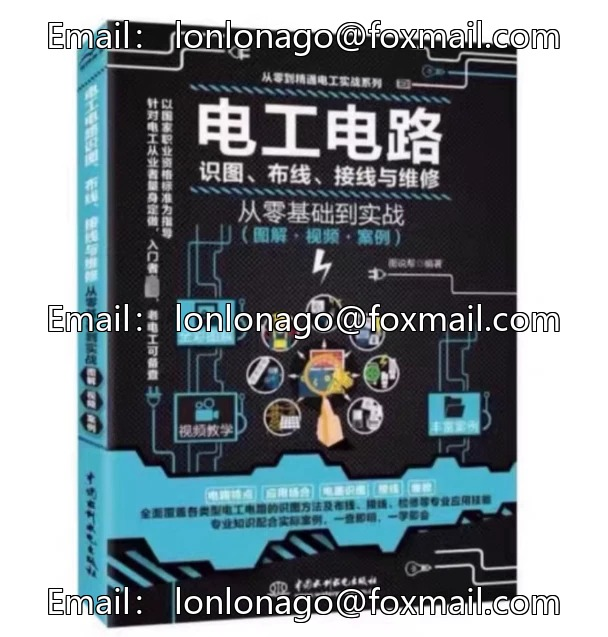
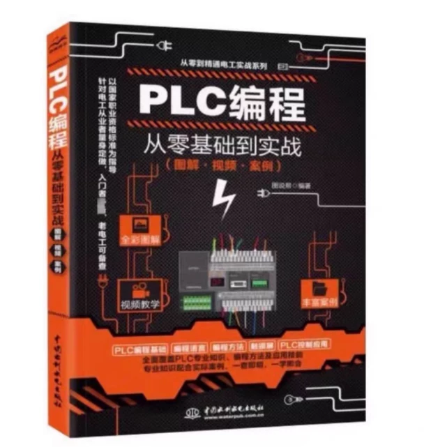

# Hello! The title you mentioned, "From Zero to Mastery: A Complete Series of Four Sets of Electrician Practical Training", sounds like a collection of tutorials or training programs on electrical skills. This set might include theoretical knowledge, practical operations, and case studies, aiming to help readers gradually improve their electrical skills from the basic level.

## Body

From Beginner to Mastery in Electrical Engineering: A Comprehensive Series of Four Volumes
From Beginner to Mastery in Electrical Engineering: A Comprehensive Series of Four Volumes
From Beginner to Mastery in Electrical Engineering: A Comprehensive Series of Four Volumes

From Beginner to Mastery: Four Volumes of High-Definition Series on Electrical Engineering Practice
High-definition, color images, with video explanations for each concept.

The page displays that there are 4 books for 2, and also buy one get one free!!!! After receiving the goods, you can choose any two close gifts from the store's homepage.

PLC programming from zero to practical (illustrated, video, case study)

Electrician from Beginner to Practical (illustrated, video, case studies)

Electrician Circuit Diagramming, Wiring, Connection and Maintenance, From Beginner to Practical (with diagrams, videos, cases)

Electronic components from zero to practical application (illustrated, video, case studies) PLC programming from zero to practical application PLC programming from zero to practical application

## Images

## Payment

Here is a pay link on Stripe ( https://buy.stripe.com/3cs8yP7sY87d0vu9AB ). Please contact me lonlonago@foxmail.com after funding $89, and I will send you a complete data files , thank you!

